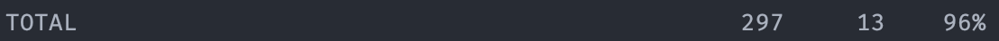

## Тестовое задание 🏋🏼‍♂️

Сервер, предоставляющий RESTful API для управления библиотекой спортивных упражнений.

Авторизация с использованием JWT.

Покрытие тестами.
___

## Реализация


### Стек:
- Python 3.12
- Django 5.0
- Django Rest Framework 3.15
- Docker

### Запуск проекта:

1) Переименовать .env-example в .env и заполнить валидными значениями.

2) В корневой директории: `docker-compose up --build -d`.

Сервер доступен по адресу: `localhost:8000`.

### Запуск тестов:

1) Переименовать .env-example в .env и заполнить валидными значениями
2) В корневой директории: `docker-compose up db -d`
3) `pytest`

### Функционал и архитектура:

- Проект состоит из приложений `core` и `exercise_library`, объединяющих в себе модели абстракций, связанных с пользователями
и упражнениями.


- База данных — `PostgreSQL`, подключается к проекту отдельным докер-контейнером.


- **CRUD**-операции доступны по следующим адресам:


  - **Пользователь**:
    - `api/signup/` — Регистрация
      
    ```
    {
        "username": "user_name",
        "password": "HighlyDifficultPass_)"
        "repeat_password": "HighlyDifficultPass_)"
    }
    ```

    - `api/login/` — Авторизация/выпуск токена
    - `api/token/refresh/` — Обновление токена
    - `api/token/update_password/` — Замена пароля


  - **Упражнения**:

    - `api/exercises/`— список всех упражнений и создание
    ```
    {
        "name": "Выпады",
        "description": "Одна нога выходит вперед, а другая остается сзади. Колени сгибаются под прямым углом, а затем опускаются вниз, пока колено задней ноги не коснётся пола.",
        "type": "Разминка",
        "level": "EASY",
        "duration": "00:01:00",
        "repetitions": "3 подхода по 4 повторения"
    }
    ```
    
    - На странице списка всех упражнений с помощью `django-filters` реализована фильтрация по:
      - Сложности упражнения;
      - Типу упражнения.


- `api/exercises/<pk>/` — получение записи упражнения (`GET`), изменение(`PUT`), удаление(`DELETE`)


  - Проект покрыт тестами на `pytest`.

  - По данным `coverage` (команда `coverage report`) покрытие составляет 96%:
 &nbsp; <p></p>
